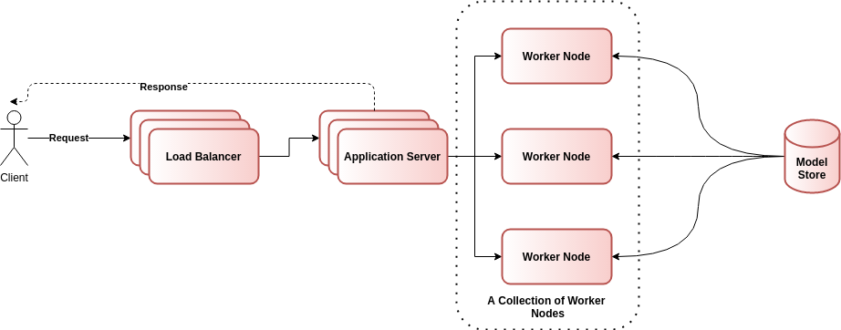

# Machine Learning Developer Challenge

## Context

The purpose of this project is to test the candidate's ability to build a simple Flask application.

## Dependencies

This project requires Python 3.8  and the popular ML libraries such as:
1. Scikit-Learn
2. Flask
3. Numpy
4. etc

We use `virtualenv` as our environment management tool. Also, we use `docker` for creating our production environment.

## How to Deploy and Run

We have used `virtualenv` and pip for setting up our local environment. For deploying the service we use `docker`. Details for setting up both environments are given below.

### Development Setup

Setting up the development environment is fairly easy with `virtualenv`. You just need to run the following command to set up the development environment.

1. Create a new virtual environment: `virtualenv -p python3.8 venv`
2. Activate it: `source ./venv/bin/activate`
3. Install dependencites: `pip install -r requirements.txt`

Now your development environment is ready. Next, you might need to run our test suite using the following command.

`python -m pytest`

Also, it is worth to note that, we have provided a configuration file that you can use to configure:
1. **Logging Parameters** - logging file name, default logging level, max logging file size, etc.
2. **Model parameters** - saved model location, etc.

### Deployment Setup

A Docker file is provided for production deployment. Please run the following commands to setup the project for production.

1. Build the docker container: `sudo docker build .`
2. Run the docker image: `sudo docker run -it -p <port_expose_to_end_user>:<port_flask_server_expose> --name <container_name> <image_name> --port <port_flask_server_expose>  --mode <DEV or TEST or DEPLOY>`

You can test the deployment using provided curl requests. 


## REST API Documentation

1. `GET http://localhost:8080/api/v1/health` - You can use this endpoint to check the status of the service. 
   1. Request - Simple GET request and no need to send additional data. 
      ```bash
      curl -X GET -H "Content-type: application/json" http://localhost:8080/api/v1/health
      ```
   2. Response
      ```json
      {
          "message": "Application is up and running"
      }
      ```
2. `POST http://localhost:8080/api/v1/predict` - You can use this endpoint for model predictions. 
   1. Request 
      ```bash
      curl -X POST -H "Content-Type: application/json"  -d '{"request_id": 1234, "text": "hello", "network": "mlp", "language": "en-US", "encoding_type": "UTF-8"}'  http://localhost:8080/api/v1/predict
      ```
   2. Response 
      ```json
      {
          "request_id": 1234,
          "sentiment": [
            {
            "sentiment_type": "toxic",
            "sentiment_score": 0.5
            },
            {
            "sentiment_type": "severe_toxic",
             "sentiment_score": 0.1
            },
            {
            "sentiment_type": "obscene",
            "sentiment_score": 0.8
            },
            {
            "sentiment_type": "threat",
             "sentiment_score": 0.9
            },
            {
            "sentiment_type": "insult",
            "sentiment_score": 0.5
            },
            {
            "sentiment_type": "identity_hate",
            "sentiment_score": 0.01
            }

          ],
          "language": "en-US"
      }
      ```
3. `GET http://localhost:8080/api/v1/statistics?api=<api_name for ex. health>` - You can use this endpoint to calculate The number of APIs calls happen in the current minute.. 
   1. Request - Simple GET request for example:  
      ```bash
      curl -X GET -H "Content-type: application/json" http://localhost:8080/api/v1/statistics?api=health
      ```
   2. Response
      ```json
      {
      "api": "health", 
      "number of calls in current minute": 5
      }
      ```
**Note**: For the current implementation, we used a simple in-memory data structure to store API call details. This is not suitable for production systems. Probably, we want to use persistent data storage such as a key-value database. 

Also, we can extend this service to get per second, minute, and hour statistics. This statistic helps for designing throttling and metering, future capacity planning, API diagnosis, and etc.

## Limitations and Future Directions
1. **Production Quality Application Server**: For the current system, we used the embedded application server that comes with `Flask`. It is really good for developing and testing applications. But it is not a good option for production with a large number of customers. For real-world deployments, I would like to use `nginx/gunicorn`.

2. **Improve the Scalability of the System**: In this assignment, we created a rudimentary system that will not scalable for thousands of users. Therefore for better scalability, we would like to propose the following system.

<div align="center">
 
 <p align="center"><b>Figure 1:</b> Improved Architecture </p>
</div>

It is worth mentioning the following points regarding the new architecture. 

1. All incoming requests will hit the load balancer first. Load balancers distribute incoming client requests to application servers. 

2. Application servers decode requests and extract the information such as `request_id` from the post body. Then application server contacts one of the available worker nodes. Worker nodes are responsible for doing the actual prediction. Worker node will send back the prediction to the application server. The application server will create a JSON response and it will send it to the client. 

3. We can dynamically scale up/down worker nodes using a container orchestration tool such as `Kubernetes`.

4. In the current version of the service, we don't have a reliable method for redeploying updated ML models. For instance, after training with more data or using a good set of hyper-parameters we might come up with a better ML model.  Currently, we don't have a suitable method to redeploy updated ML model. We will address this issue in one of the upcoming releases. 

5. In the current version of the API doesn't support Throttling and Metering capabilities. We will provide these capabilities in one of the upcoming releases. 
   


